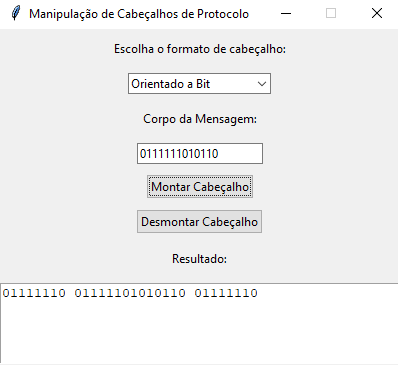
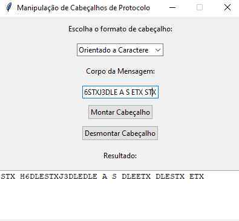
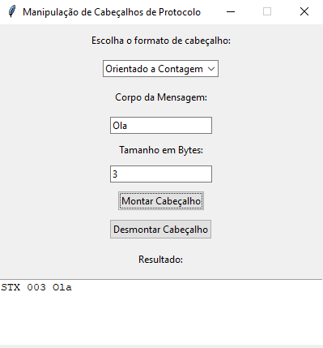

# Head Split [Manipulação de Cabeçalhos de Protocolo] 

Este projeto fornece uma interface gráfica para manipulação de cabeçalhos de protocolo. Ele oferece diferentes tipos de cabeçalhos orientados a bits, caracteres e contagem de bytes. O usuário pode montar e desmontar cabeçalhos usando diferentes técnicas de formatação, como **Bit Stuffing**, **Character Stuffing**, e **Byte Counting**.

## Funcionalidades

O aplicativo permite ao usuário:

### **1. Montar Cabeçalhos**

#### **Orientado a Bit**
Usa a técnica de Bit Stuffing para garantir que o cabeçalho e a mensagem não contenham a sequência de bits `01111110`.



---

#### **Orientado a Caractere**
Usa a técnica de Character Stuffing, substituindo caracteres especiais, como `DLE`, `STX`, e `ETX`.



---

#### **Orientado a Contagem de Byte**
Usa o comprimento da mensagem (em bytes) para formar o cabeçalho.



---

### **2. Desmontar Cabeçalhos**
O usuário pode extrair a mensagem original dos cabeçalhos montados.


- **Desmontar Cabeçalhos**: O usuário pode extrair a mensagem original dos cabeçalhos montados.

## Instalação

Para rodar este projeto em sua máquina local, siga os passos abaixo:

1. Clone este repositório:

   ```bash
   git clone https://github.com/seu-usuario/HeadSplit.git
   ```

2. Navegue até a pasta do projeto:

```bash
  cd HeadSplit
```

3. Instale as dependências necessárias:

O projeto usa a biblioteca `tkinter` para a interface gráfica, que é normalmente instalada por padrão no Python. Se você tiver problemas, certifique-se de que o tkinter está instalado:

```bash
  pip install tk
```

4. Execute o aplicativo

```bash
  python main.py
```


